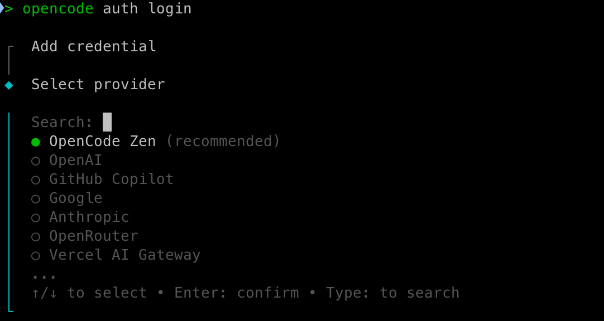

# OpenCode 教程：终端 AI 编程助手从入门到进阶

[OpenCode](https://opencode.ai) 是一款开源的终端 AI 编程助手，基于 client/server 架构，提供 TUI（终端用户界面）交互，支持多 AI 提供商（Anthropic、OpenAI、Gemini 等），并内置 LSP 支持。它面向「不离开终端」的开发流程，让你在命令行里完成代码理解、编写、修改与调试。

本文从安装、配置、多 Agent 到插件，带你完整上手 OpenCode。

## 1. 安装

OpenCode 支持多种安装方式，选择你习惯的一种即可。

### 1.1 安装脚本（推荐，跨平台）

```bash
curl -fsSL https://opencode.ai/install | bash
```

### 1.2 Homebrew（macOS / Linux）

```bash
brew install anomalyco/tap/opencode
```

### 1.3 Node.js 生态

```bash
# npm
npm install -g opencode-ai

# yarn
yarn global add opencode-ai

# pnpm
pnpm add -g opencode-ai

# bun
bun add -g opencode-ai
```

安装完成后，在终端输入 `opencode` 即可启动 TUI 界面。

## 2. 快速上手

### 2.1 登录 AI 提供商

首次使用需要配置模型提供商的 API Key：

```bash
opencode auth login
```



该命令会列出可用的提供商（来自 Models.dev），选择后输入 API Key。凭据默认存储在 `~/.local/share/opencode/auth.json` ，也可以通过环境变量或项目内 `.env` 文件配置。

在 TUI 内也有对应的交互式命令：

* `/connect` — 连接/切换提供商
* `/models` — 选择当前使用的模型

### 2.2 初始化项目

在项目根目录启动：

```bash
opencode
```

使用 `/init` 命令可以自动生成项目级配置文件AGENTS.md。

## 3. 配置文件 opencode.json

OpenCode 的项目级配置写在根目录的 `opencode.json` （或 `opencode.jsonc` ）中，全局配置位于 `~/.config/opencode/` 。

一个典型的配置文件：

```json
{
  "$schema": "https://opencode.ai/config.json",
  "default_agent": "build",
  "model": "anthropic/claude-sonnet-4-5",
  "plugin": [
    "opencode-gitlab-plugin",
    "@my-org/custom-plugin"
  ]
}
```

关键字段：

| 字段 | 作用 |
| --- | --- |
| `default_agent` | 未显式指定时使用的主 Agent |
| `model` | 默认模型 |
| `plugin` | 要加载的插件（npm 包名数组） |
| `instructions` | 额外规则文件路径（支持 glob） |
| `agent` | 自定义 Agent 定义（见下一节） |

## 4. 多 Agent 设置

OpenCode 支持通过 `agent` 字段定义多个专用 Agent，每个 Agent 可以指定不同的模型、系统提示词和工具权限。

### 4.1 三种模式（mode）

每个 Agent 有一个 `mode` ，决定它的使用方式：

* `primary` — 主 Agent，作为会话的编排者
* `subagent` — 子 Agent，只能被其它 Agent 通过 Task 工具调用
* `all` — 既可作主 Agent 也可作子 Agent（**默认值**）

### 4.2 定义专用 Agent

```jsonc
{
  "$schema": "https://opencode.ai/config.json",
  "agent": {
    "code-reviewer": {
      "description": "Reviews code for best practices and potential issues",
      "model": "anthropic/claude-sonnet-4-5",
      "prompt": "You are a code reviewer. Focus on security, performance, and maintainability.",
      "tools": {
        // 禁用写文件工具，实现只读审查
        "write": false,
        "edit": false
      }
    }
  }
}
```

### 4.3 用 Markdown 定义子 Agent

除了 JSON，你还可以在 `~/.config/opencode/agents/` 目录下用 Markdown 文件定义 Agent，frontmatter 声明元信息：

```markdown
---
description: Performs security audits and identifies vulnerabilities
mode: subagent
permission:
  edit: deny
---

You are a security expert. Focus on identifying potential security issues.

Look for:

- Input validation vulnerabilities
- Authentication and authorization flaws
- Data exposure risks
- Dependency vulnerabilities
- Configuration security issues
```

### 4.4 控制子 Agent 的调用权限

通过 `permission.task` 的 glob 模式，精确控制一个编排 Agent 可以调用哪些子 Agent：

```json
{
  "agent": {
    "orchestrator": {
      "mode": "primary",
      "permission": {
        "task": {
          "*": "deny",
          "orchestrator-*": "allow",
          "code-reviewer": "ask"
        }
      }
    }
  }
}
```

以上配置表示： `orchestrator` 默认不能调用任何子 Agent，但可以调用 `orchestrator-*` 前缀的 Agent，调用 `code-reviewer` 时需要询问用户确认。

## 5. 插件安装

OpenCode 的插件是 JavaScript/TypeScript 模块，可以 hook 进事件系统来扩展功能、添加自定义工具和集成。

### 5.1 命令行安装

```bash
# 完整命令
opencode plugin <module>

# 别名
opencode plug <module>

# 全局安装
opencode plug --global <module>
```

### 5.2 配置方式

也可以在 `opencode.json` 的 `plugin` 数组中直接声明 npm 包名：

```json
{
  "$schema": "https://opencode.ai/config.json",
  "plugin": [
    "opencode-helicone-session",
    "opencode-gitlab-plugin"
  ]
}
```

### 5.3 常用插件

| 插件 | 功能 |
| --- | --- |
| `opencode-helicone-session` | Helicone 会话追踪与观测 |
| `opencode-gitlab-plugin` | GitLab API 工具集成 |
| `opencode-skills` | 自动发现并注册 Skills 为动态工具 |
| `@tarquinen/opencode-dcp` | DCP 动态上下文剪枝，自动清理对话中过期的工具输出，节省 token |
| `opencode-gemini-auth` | 复用 Gemini CLI 的 OAuth 登录凭据，免去重复认证 |
| `opencode-antigravity-auth` | Google Antigravity IDE OAuth 认证，用 Google 凭据访问 Gemini 3 Pro / Claude 4.6 |
| `oh-my-openagent` | 多模型编排 + 并行后台代理 + LSP/AST 工具的 batteries-included 插件套件 |

下面是我本机 `~/.config/opencode/opencode.json` 中实际启用的一组插件，可作为参考：

```json
{
  "$schema": "https://opencode.ai/config.json",
  "plugin": [
    "@tarquinen/opencode-dcp@latest",
    "opencode-gemini-auth@latest",
    "opencode-antigravity-auth@latest",
    "oh-my-openagent@v4.19.4"
  ]
}
```

各插件说明：

- **`@tarquinen/opencode-dcp`**（[github.com/Opencode-DCP/opencode-dynamic-context-pruning](https://github.com/Opencode-DCP/opencode-dynamic-context-pruning)）：DCP 即 *Dynamic Context Pruning*，通过剪枝对话上下文里已过时的工具输出（tool output）来优化 token 用量，降低长会话的成本与噪声。
- **`opencode-gemini-auth`**（[github.com/jenslys/opencode-gemini-auth](https://github.com/jenslys/opencode-gemini-auth)）：让 OpenCode 直接复用 Gemini CLI 的 OAuth 登录态，配合 `@ai-sdk/google` 使用 Google 模型时无需再单独跑 `opencode auth login`。
- **`opencode-antigravity-auth`**（[github.com/NoeFabris/opencode-antigravity-auth](https://github.com/NoeFabris/opencode-antigravity-auth)）：Google Antigravity IDE 的 OAuth 认证插件，用 Google 凭据访问 Gemini 3 Pro、Claude 4.6 等模型。
- **`oh-my-openagent`**（[github.com/code-yeongyu/oh-my-openagent](https://github.com/code-yeongyu/oh-my-openagent)）：功能最全的「全家桶」套件，详见下一节。

### 5.4 oh-my-openagent 详解

`oh-my-openagent`（简称 OmO，口号 "The Best AI Agent Harness"）是一个 batteries-included 的 OpenCode 插件套件，核心能力：

- **多模型编排**：一个会话内可在多个 provider（DeepSeek、Gemini、Claude、本地 Ollama 等）间路由，按任务难度分配不同模型。
- **并行后台代理**：内置 `oracle`（高 IQ 只读顾问）、`librarian`（外部文档/仓库检索）、`explore`（代码库 grep）等子代理，可并行后台运行。
- **LSP/AST 工具**：封装 `lsp_*`（跳转、引用、诊断、重命名）与 AST 级代码工具，编辑前先看符号结构与影响面。
- **Team Mode**：创建并管理并行代理团队协作。
- **Skills**：附带 `init-deep`（生成层级化 AGENTS.md）、`security-research`（安全审计）等技能。

安装后额外提供命令行入口 `omo`（等价于 `oh-my-opencode` / `oh-my-openagent`）。锁定版本可写死，如 `"oh-my-openagent@v4.19.4"`，也可以 `@latest` 跟随最新。

## 6. 常用 Slash 命令

在 TUI 中，输入 `/` 可以访问内置命令：

| 命令 | 作用 |
| --- | --- |
| `/help` | 显示帮助 |
| `/connect` | 连接提供商 |
| `/models` | 切换模型 |
| `/init` | 初始化项目配置 |
| `/compact` | 压缩上下文 |
| `/export` | 导出会话 |
| `/share` / `/unshare` | 分享 / 取消分享会话 |
| `/sessions` | 查看会话列表 |
| `/new` | 新建会话 |
| `/themes` | 切换主题 |
| `/thinking` | 切换思考模式 |
| `/undo` / `/redo` | 撤销 / 重做 |
| `/editor` | 打开编辑器 |
| `/exit` | 退出 |

## 7. 自定义命令与规则

### 7.1 自定义命令

在 `opencode.jsonc` 中用 `command` 字段定义快捷命令：

```json
{
  "$schema": "https://opencode.ai/config.json",
  "command": {
    "test": {
      "template": "Run the full test suite with coverage report and show any failures.\nFocus on the failing tests and suggest fixes.",
      "description": "Run tests with coverage",
      "agent": "build",
      "model": "anthropic/claude-sonnet-4-5"
    }
  }
}
```

定义后在 TUI 中输入 `/test` 即可触发。

### 7.2 AGENTS.md 规则文件

OpenCode 支持类似 Cursor Rules 的 `AGENTS.md` 文件，用于为特定项目注入自定义指令。这些指令会被包含进 LLM 的上下文中，从而定制其在项目中的行为。

在 `opencode.json` 中通过 `instructions` 字段指定规则文件路径（支持 glob）：

```json
{
  "$schema": "https://opencode.ai/config.json",
  "instructions": [
    "docs/development-standards.md",
    "test/testing-guidelines.md",
    "packages/*/AGENTS.md"
  ]
}
```

### 7.3 /init-deep 生成层级化 AGENTS.md

除了手写 `AGENTS.md`，OpenCode 还提供了 `/init-deep` 命令，自动为项目生成**层级化**的 `AGENTS.md` 知识库：在项目根目录创建总纲，并在复杂度较高的子目录按需生成专属 `AGENTS.md`，让子模块的规则就近维护。

```bash
/init-deep                      # 更新模式：增量修改已有文件 + 在需要处新建
/init-deep --create-new         # 重建模式：读取现有内容后全部删除，从零重新生成
/init-deep --max-depth=2        # 限制扫描的目录深度（默认 3）
```

**工作流程**：

1. **发现与分析**（并发）— 派发 explore 子代理并行扫描项目结构、入口、约定、反模式、构建/CI 与测试模式；主会话同步做 bash 结构分析、读取已有 `AGENTS.md`、用 LSP/codegraph 构建代码地图。
2. **评分与决策** — 按「文件数 / 子目录数 / 代码占比 / 模块边界 / 符号密度 / 引用中心度」等维度为每个目录打分，决定哪些目录值得单独放一个 `AGENTS.md`（根目录必定生成；高分目录单独生成；低分目录跳过由父级覆盖）。
3. **生成** — 先写根 `AGENTS.md`，再并行生成各子目录的 `AGENTS.md`。
4. **审查去重** — 去除通用建议、删除与父级重复的内容、精简到合适篇幅。

生成的根 `AGENTS.md` 通常包含：概览、目录结构、代码地图（符号/类型/位置/引用数）、项目特有约定、本项目禁用的反模式、常用命令、易踩坑点等。子目录 `AGENTS.md` 只保留与父级不同、且专属于该模块的内容，避免冗余。

> **提示**：`/init-deep` 生成的是面向「未来 Agent 会话」的项目知识库，适合中大型、结构复杂的仓库；小项目用 `/init` 生成单个 `AGENTS.md` 即可。

## 8. 小结

OpenCode 的核心优势在于：**纯终端操作**、**多 Agent 编排**、**插件生态**和**多提供商支持**。通过 `opencode.json` 统一管理 Agent、插件与规则，配合 `AGENTS.md` 固化项目规范，可以构建一套高度定制化的 AI 编码工作流。

更完整的配置项请参考官方文档：<https://opencode.ai/docs>。
